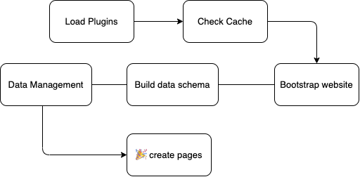
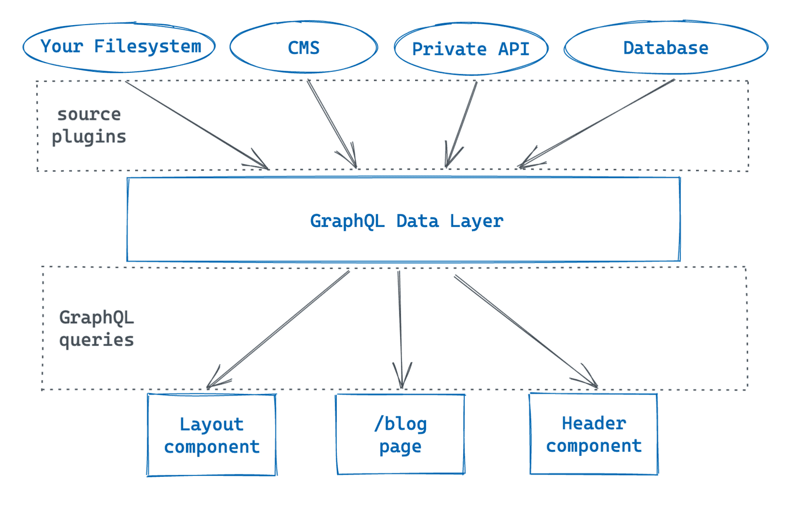
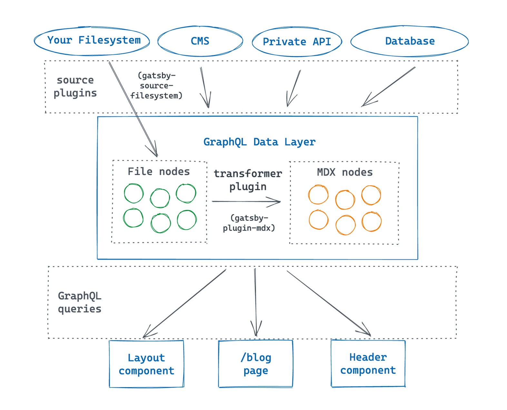

A one-liner introduction for Gatsby -- It is a modern web framework to develop blazing fast websites.  In simpler terms, Gatsby statically generates web pages by pulling data from sources at the build time. It actually leverages Node and webpack processes to package and build sites. So, a node server is core which runs the gatsby commands.

All the magic that gatsby does happens at the build time, that is, it pulls all the required data and then transpiles the react application into a static web page. 

Lets look all these things a bit more details.

---

## **What is build time ?**

"It is a process of using a server to compile the site into files that can be delivered to a web browser later." So basically converting your Gatsby (React) Application into plain static browser readable html page. It is important to note that Browser APIs like window aren't available at build time, and developers need to write null safe code. 

A common error which prompts at `gatsby build` is `window is not defined.` And often you can fix this error by encapsualting the browser specific code for example -

```jsx
if (typeof window !== `undefined`) {
		// your browser logic
		// Ex - window.location.href = "blah"
 } 
```

Gatsby executes a chunk of processes during its build time, most importantly the **Bootstrap Sequence & Build Sequence,** which are the core parts of its lifecycle. Here's an interesting [article](https://medium.com/narative/understanding-gatsbys-lifecycle-31c473ba2f2d) about gatsby lifecycle. 

Now, lets look at the Node process which actually runs `gatsby build`.

---

## The Node Process - what actually happens at build?

"A Node.js server process powers things behind the scenes when you run the `gatsby build` command. *The process of converting assets and pages into HTML that can be rendered in a browser."*

Initially, this process uses webpack & babel to transpile the code you write ( modern ecmascript syntax), scan all the javascript files, wire the dependencies, and compiles them into optimized & browser readable bundle. 

It is important to note that once it is deployed, it doesn't need to run any server-side processes because everything has been bundled and compiled by gatsby at once during the build time. So for every request of webpage we just have to deliver the pre-built static web pages.



Above image describes the lifecycle in a very clear way, — During the Node process Gatsby will load plugins, check the cache, bootstrap the website, build the data schema, create pages, and deal with some configuration and data management. (Some of the steps are explained below.)

Now lets look at how gatsby fetches and feeds data into the static pages.

---

## Data Layer

Gatsby has a powerful feature called the data layer that you can use to pull data into your site from anywhere. During the build, data is fetched and combined into a GraphQL schema with a static snapshot of all data your site needs. It lets you configure multiple data sources suitable for your data needs.



**How do you get data from its source into the data layer ?** 

By adding a additional plugins called **source plugins.** Each source plugin is designed to to fetch data from a specific source and adds it to your site’s GraphQL data layer. These plugins automatically add relevant schema to the data layer and corresponging resolver functions to fetch data. 

> Sitemetadata defined in `gatsby-config.js`  gets pulled into the GraphQL data layer automatically.(without the use of source plugins)

**How do you get data back out of the data layer ?** 

A simple graphql query is used to plug data into components. When you build your site, Gatsby will find all the GraphQL queries in your components, run them, and put the resulting data in your component. 

> To pull data into a building-block component, you’ll use a pre-defined function from Gatsby called `useStaticQuery`.


---

## Nodes & Transformers

A slight deep dive into how does the data layer handles all the data.

Data layer stores information in abstract objects called nodes. A node is the smallest form unit of data in the data layer. Different source plugins create different types of nodes, each of which have their own properties. For example, `gatsby-source-filesystem` creates File nodes, however we cannot access the file data directly using static query. Hence, we use transformer plugin to convert those nodes to other readable form of nodes. (ex- from File Node to text Node)

> A **transformer plugin** converts nodes from one type to another.

Each transformer plugin creates new nodes based on the data from the sourced nodes, but it doesn’t actually change the source nodes themselves, they create a new copy with a modified data.



## Some points to note about gatsby

- `Gatsby-ssr.js` & `Gatsby-node.js` allows us to hook into gatsby lifecycle.
- Everything that occurs after your static site has loaded can be hooked in using `gatsby-browser.js`

## References

- Images & Content - Gatsby docs
- Cover Pic - Unsplash (Photo by S O C I A L . C U T)